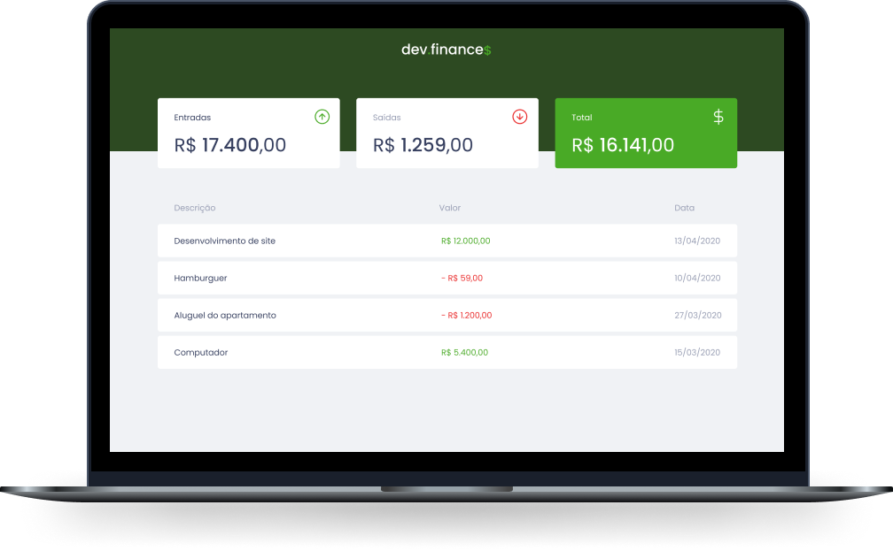

<h1 align="center">
  
</h1>

  <a href="#-technologies">Technologies</a>&nbsp;&nbsp;&nbsp;|&nbsp;&nbsp;&nbsp;
  <a href="#-project">Project</a>&nbsp;&nbsp;&nbsp;|&nbsp;&nbsp;&nbsp;
  <a href="#-to-do">To-do</a>&nbsp;&nbsp;&nbsp;|&nbsp;&nbsp;&nbsp;
  <a href="#-license">License</a>

  [Technologies](#technologies)
  [Project](#project)
  [To-do](#to-do)
  [License](#license)

<!-- 
CORRIGIR ANCORA DO DESAFIO
 -->

 

  

 

  

## 🚀 Technologies

This project was developed with the following technologies:

- HTML
- CSS
- JavaScript

## 💻 Project

dev.finances is a financial control application, where you can register and delete transactions and see the input and output balance 💰

Special thanks to [Rocketseat](https://discordapp.com/invite/gCRAFhc) for the [<strong>1st Discover Marathon</strong>](https://github.com/rocketseat-education/maratona-discover-01).

<h2 id="to-do">🛠️ To-do</h2>

## 🛠️ To-do

- [x] Theme Toggler (light | dark)
- [x] Deploy on (Netlify)[https://minhascontas.netlify.app/]
- [ ] Create new logo (dev.finances => my accounts)
- [ ] Synchronization with DB
- [ ] Add tags
- [ ] Filter by date / tags
- [ ] Duplicate / Repeat common expenses and earnings

## 📝 License

This project is under the MIT license. See the [LICENSE](LICENSE.md) file for more details.

---

Made by (Felipe)[https://github.com/felipepereirapinto]
